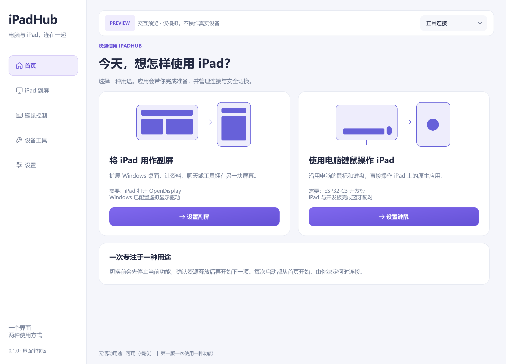

# iPadHub

简体中文 | [English](README.en.md)

**把 iPad 副屏和键鼠控制放进同一个 Windows 应用。**

用 USB 或 Wi-Fi 将 iPad 作为电脑副屏，也可以通过 ESP32-C3 开发板，用电脑键鼠操作 iPad 自身的应用。

当前版本为 **0.1.0-preview**。[下载](https://github.com/tukitohosi/ipad-hub/releases/tag/v0.1.0-preview) · [使用说明](docs/使用说明.md)

## 主要功能

| 功能 | 能做什么 | 需要什么 |
| --- | --- | --- |
| iPad 副屏 | 扩展 Windows 桌面，支持 USB／Wi-Fi、设备发现和画质预设 | iPad 上的 OpenDisplay、Windows 虚拟显示驱动；USB 另需 Apple 设备服务 |
| 键鼠控制 | 操作 iPad 原生应用，支持左右摆放、自由／锁定模式和速度调整 | ESP32-C3 开发板通过 USB 连接电脑，并与 iPad 蓝牙配对 |
| 设备工具 | 备份、刷入和恢复开发板固件 | 兼容开发板与 USB 数据线 |

目前每次使用一种功能。切换时，应用先停止当前功能并释放设备，再启动另一种功能。

## 下载与安装

在 [发布页](https://github.com/tukitohosi/ipad-hub/releases/tag/v0.1.0-preview) 选择：

- iPadHub-0.1.0-preview-Setup-x64.exe：Windows x64 安装版。
- iPadHub-0.1.0-preview-Windows-x64.zip：便携版，完整解压后打开 iPadHub.exe。
- iPadHub-0.1.0-preview-source.zip：与本次发布程序对应的源码。

副屏驱动和 iPad 接收端需要单独安装，安装器不修改防火墙。发布页同时提供文件校验清单。

## 使用与数据

首页不会自动连接设备或接管键鼠。关闭窗口收起到托盘；从托盘退出会停止后台。键鼠控制的紧急返回快捷键为 **Ctrl + Alt + Esc**。

首次运行会复制兼容的旧设置和固件备份到当前用户的 LocalAppData/iPadHub 目录。MouseLink 和 iPad互联可以继续保留；使用原应用前，先退出 iPadHub，避免争用同一设备。卸载默认保留用户数据。

## 使用限制

- 当前为整合预览版，副屏与键鼠控制不能同时使用。
- 副屏需要 OpenDisplay 保持前台以及可用的第三方显示驱动。
- 键鼠控制需要兼容 ESP32-C3；电脑自身的蓝牙不能替代开发板。
- 刷写固件期间需保持 USB 连接。恢复备份前，工具会核对目标设备。

## 开发与许可

源码包含统一界面、MouseLink 键鼠后台和 iPad互联副屏后台。构建方式见 [构建说明](docs/packaging.md)。

项目按 [GPL-3.0](LICENSE) 提供对应源码，各组件保留原有许可。详见 [第三方声明](THIRD_PARTY_NOTICES.md)。
